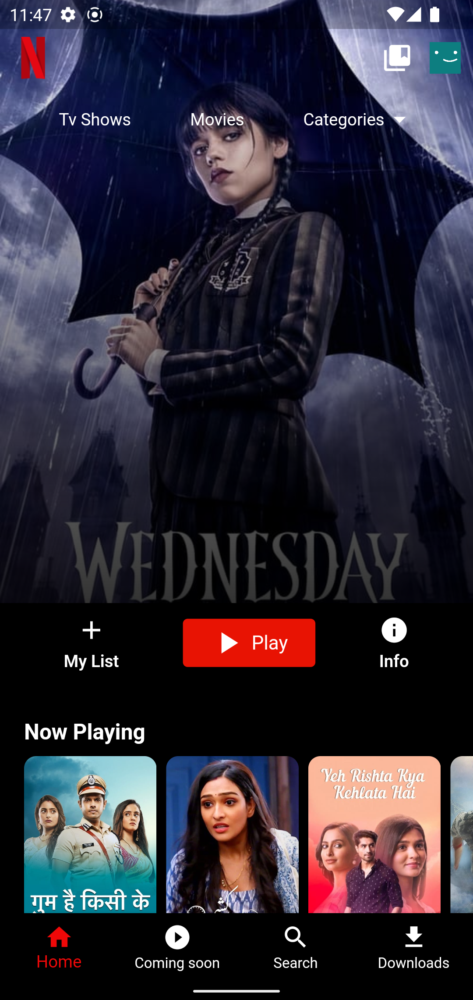
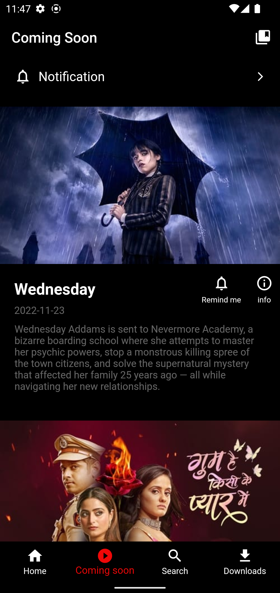
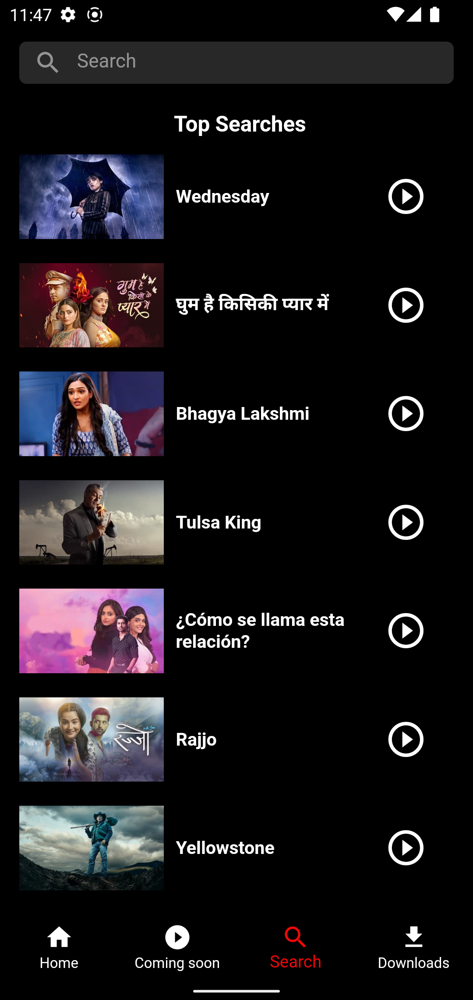

 # Netflix Clone UI

This is a clone application using TMDb REST API.Used GET method for fetching the series details from the API. Created this for learing API calls.

## Table of contenst

- [Installation](#installation)
- [Screeshots](#screenshots)
- [Packages and Credits](#packages-and-credits)
- [License](#license)

## Installation

To install and run this project, you will need to have the following dependencies installed on
your machine:
 - Flutter SDK
 - Android Studio or Visual Studio Code

To install the project, follow these steps:

1. Clone the repository to your local machine
2. Open the project in Android Studio or Visual Studio Code
3. Connect an Android device or lauch an emulator
4. Run the command 'flutter pub get' using the terminal
5. Run the project by clicking the "run" button in the top menu or by using the terminal
   command 'flutter run'

## Screenshots 

Home Screen             |  Coming Soon Screen   |  Search Screen
:-------------------------:|:-------------------------:|:-------------------------:
||

## Packages and Credits

- [Http](https://github.com/dart-lang/http/tree/master/pkgs/http)
- [Json annotation](https://github.com/google/json_serializable.dart/tree/master/json_annotation)
- [Json serializable](https://github.com/google/json_serializable.dart/tree/master/json_serializable)

## License

- MIT License
- Copyright 2022 © [ASWINSUBHASH](https://github.com/aswinsubhash)

